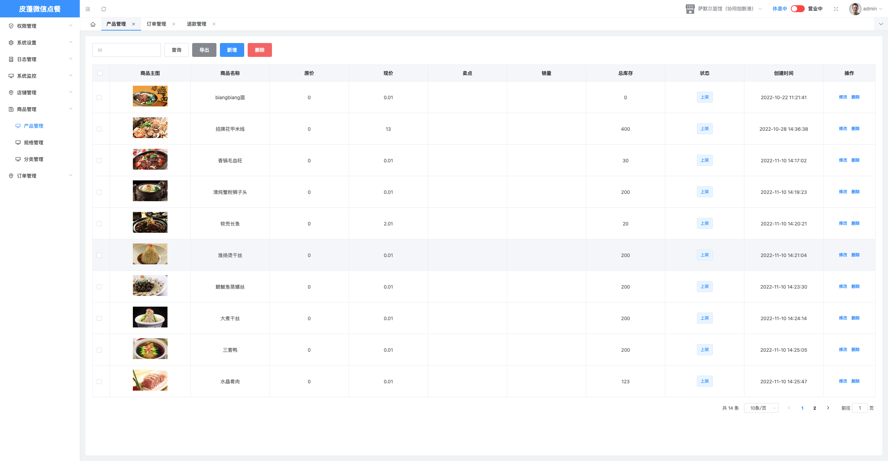
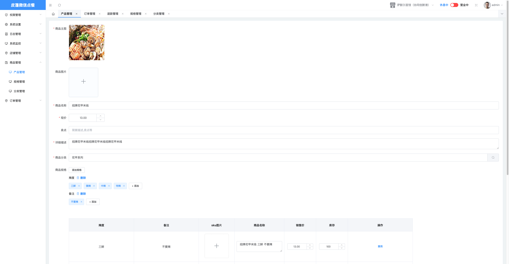
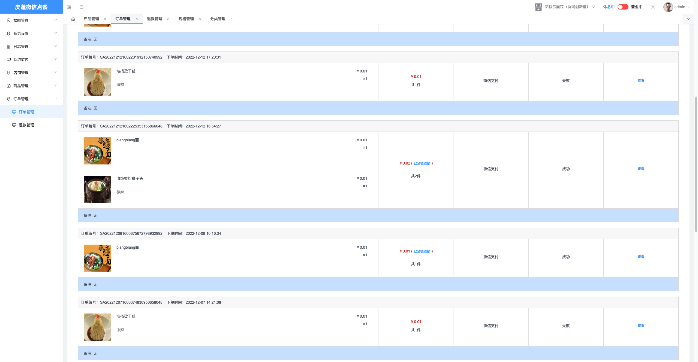
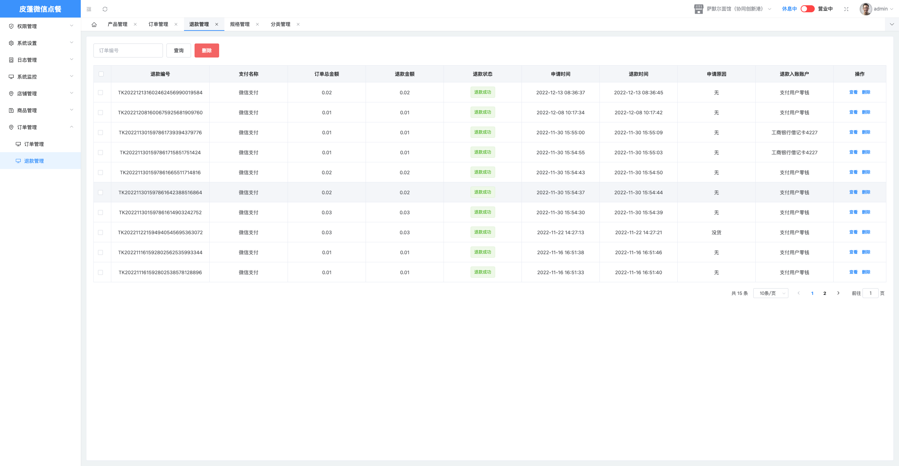

# 皮蓬微信小程序点餐系统

## 1. 它是干什么的

小程序点餐系统，实现用户在线点餐下单、菜品展示、加入购物车、提交订单、支付功能、对接网络打印机，减少人员接触降低成本。

使用过程中有任何问题，欢迎通过Issues与我进行交流。

还有如果本项目对您有所帮助或者启发，请给我点个Star支持一下吧，您的支持鼓励是我最大的动力。

## 2. 使用的技术

- 核心框架：Spring Boot 2.7
- 安全框架：Apache Shiro 1.10
- 持久层框架：MyBatis-Plus 3.5
- 消息队列：RabbitMQ
- 定时器：Quartz 2.3
- 数据库连接池：Druid 1.2
- 日志管理：Logback
- 页面交互：Vue2.x
- 微信开发SDK： WxJava 4.4.4.B
- 工具类库：Hutool 5.7

## 3. 使用教程

### 项目结构

```
wei-order
├── order-admin 管理后台
│   └── db      数据库SQL脚本
│
├── order-api   API服务，小程序接口访问
│
├── order-bean  实体类对象
│
├── order-common      公共模块
│
├── order-dao         持久层
│   └── resources
│        └── mapper   Mybatis文件
│        
├── order-job         定时任务模块
│
├── order-miniapp     小程序模块
│
├── order-msg         消息处理模块
│
├── order-oss         文件存储模块
│
├── order-pay         支付模块
│	└── resources
│
├── order-service     服务层
│
├── order-shiro       权限认证模块
│
└── renren-generator  人人平台代码生成模块
```

由于此项目是基于 [renren-security]([renren-security](https://gitee.com/renrenio/renren-security)) 进行的开发，所以在项目部署使用方面基本和[renren-security](https://gitee.com/renrenio/renren-security) 相同，在这里主要介绍以下几点需要注意的地方：

1. 微信支付的配置

   微信支付使用的是开源的微信SDK [WxJava](https://github.com/Wechat-Group/WxJava)可以参考这个开源项目的说明文件进行配置。

2. 后端地址：

   - Github: https://github.com/pippen57/wei-order
   - Gitee: https://gitee.com/pippen57/wei-order

3. 后端UI:

   - Github: https://github.com/pippen57/wei-order-ui
   - Gitee: https://gitee.com/pippen57/wei-order-ui

4. 小程序：

   - Github: https://github.com/pippen57/wei-order-mini
   - Gitee: https://gitee.com/pippen57/wei-order-mini

### 项目部署流程

- 通过git下载源码
- idea需安装lombok插件，不然会提示找不到entity的get set方法
- 创建数据库wei_order，数据库编码为UTF-8
- 执行db/mysql.sql文件，初始化数据
- 修改application-dev.yml文件，更新MySQL账号和密码，修改Redis和RabbitMQ地址
- 在wei-order目录下，执行mvn clean install
- IDEA运行AdminApplication.java，则可启动项目【order-admin】
- order-admin访问路径：http://localhost:8083/order-admin
- swagger文档路径：http://localhost:8083/order-admin/doc.html
- 再启动前端项目，前端地址：https://gitee.com/renrenio/renren-ui
- 账号密码：admin/admin

### 和我交流

扫描下方二维码添加微信，备注【皮蓬】加快通过速度。


**来几张项目截图：**









## 4. 鸣谢

* [renren-security](https://gitee.com/renrenio/renren-security)  采用SpringBoot2、MyBatis-Plus、Shiro框架，开发的一套权限系统，极低门槛，拿来即用。设计之初，就非常注重安全性，为企业系统保驾护航，让一切都变得如此简单。

